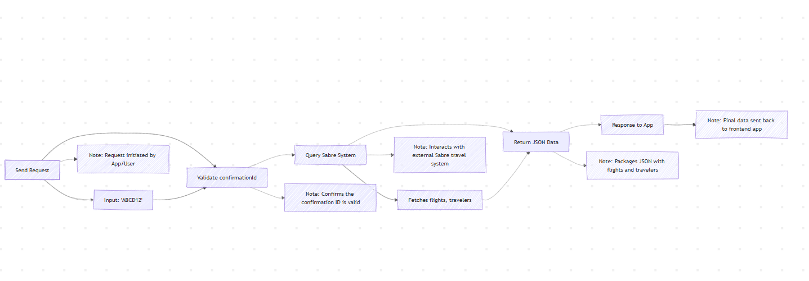

# Get Booking Method - Sabre Booking Management API

## Table of Contents
- [Overview](#overview)
- [Why Use It?](#why-use-it)
- [How It Works](#how-it-works)
- [Making the Request](#making-the-request)
- [Response Examples](#getting-a-response)
- [Common Errors](#common-errors)
- [Try It Out](#try-it-out)
- [Postman Collection](#postman-collection)


## Overview

The **Get Booking method** lets you fetch travel booking details—like flights, travelers, or hotels—from Sabre’s Booking Management API using a `confirmationId` (e.g., a PNR locator like `ABCD12`). It’s a RESTful POST endpoint that’s perfect for building travel apps, whether you’re showing full itineraries, validating ownership, or grabbing just the data you need. Think of it as your app’s window into Sabre’s reservation system!

### Why Use It?
- **Quick Lookup:** Pull all booking details in one shot for a “My Trips” page.
- **Validation:** Check if a booking matches a traveler’s surname.
- **Efficiency:** Filter to specific pieces (e.g., flights only) to keep responses light.
- **Troubleshooting:** Inspect bookings to fix issues like missing tickets.

**Endpoint:** `POST /v1/trip/orders/getBooking`  
**Base URL:** `https://api.sabre.com`

## How It Works

Here’s the flow when you call Get Booking:



1. **Validate Input:** Checks the `confirmationId` and your access rights.
2. **Query Sabre System:** Pulls the booking data from Sabre’s database.
3. **Return Data:** Sends back a neat JSON response.

## Making the Request

### Headers
- `Authorization: Bearer {your-api-token}`
- `Content-Type: application/json`

### Request Examples

#### 1. Get Full Booking
Fetch everything about a booking.

```json
{
  "confirmationId": "ABCD12"
}
```

#### 2. Validate with Surname
Confirm the booking belongs to a traveler.

```json
{
  "confirmationId": "ABCD12",
  "surname": "Smith"
}
```

#### 3. Get Specific Elements
Only grab what you need (e.g., flights and travelers).

```json
{
  "confirmationId": "ABCD12",
  "returnOnly": ["FLIGHTS", "TRAVELERS"]
}
```

### Request Parameters

| Parameter        | Required | Description                              | Example            |
|------------------|----------|------------------------------------------|--------------------|
| `confirmationId` | Yes      | The booking’s PNR locator or order ID.   | `"ABCD12"`         |
| `surname`        | No       | Traveler’s last name for validation.     | `"Smith"`          |
| `returnOnly`     | No       | Filters response to specific data types. | `["FLIGHTS"]`      |

> **Note:** `returnOnly` supports `FLIGHTS`, `TRAVELERS`, `HOTELS`, `TICKETS`, `PAYMENTS`. See Sabre’s docs for more options!

## Getting a Response

### Status Codes
- `200 OK`: Success—here’s your data!
- `400 Bad Request`: Check your input.
- `401 Unauthorized`: Token trouble.
- `503 Service Unavailable`: Sabre’s servers are busy.

### Response Examples

#### 1. Full Booking (200 OK)
```json
{
  "flightSegments": [
    {
      "flightNumber": "BA891",
      "departureDateTime": "2025-04-30T14:40:00Z",
      "arrivalDateTime": "2025-04-30T16:00:00Z",
      "origin": "SOF",
      "destination": "LHR"
    }
  ],
  "travelers": [
    {
      "index": 1,
      "name": "John Smith"
    }
  ],
  "bookingSignature": "c137df6aadc891d725bbb6e23fa6bd41"
}
```

#### 2. Selected Elements (200 OK)
```json
{
  "flightSegments": [
    {
      "flightNumber": "BA891",
      "departureDateTime": "2025-04-30T14:40:00Z",
      "origin": "SOF",
      "destination": "LHR"
    }
  ],
  "travelers": [
    {
      "index": 1,
      "name": "John Smith"
    }
  ]
}
```

#### 3. Error (400 Bad Request)
```json
{
  "error": {
    "code": "INVALID_CONFIRMATION_ID",
    "message": "The confirmation ID provided is not valid."
  }
}
```

### Response Fields

| Field             | Description                          | Example            |
|-------------------|--------------------------------------|--------------------|
| `flightSegments`  | Array of flight details.             | See above          |
| `travelers`       | List of traveler info.               | `"name": "John Smith"` |
| `bookingSignature`| Unique hash for booking integrity.   | `"c137df6aadc89..."` |

## Common Errors

| Category         | Code                    | Description                              | Fix It                            |
|------------------|-------------------------|------------------------------------------|-----------------------------------|
| **Input**        | `INVALID_CONFIRMATION_ID` | `confirmationId` doesn’t exist.         | Check the ID (e.g., 6 chars).     |
|                  | `SURNAME_MISMATCH`       | Surname doesn’t match.                  | Verify traveler’s last name.      |
| **Request Format**| `MISSING_REQUIRED_FIELD` | Forgot `confirmationId`.                | Include it—it’s required!         |
|                  | `INVALID_RETURN_ONLY`    | Bad `returnOnly` value.                 | Use valid options (e.g., `FLIGHTS`). |
| **Permissions**  | `UNAUTHORIZED_ACCESS`    | Invalid token.                          | Check your `Authorization` header.|
| **System**       | `SERVICE_UNAVAILABLE`    | Sabre’s down.                           | Wait, then retry.                 |

> **Tip:** Error messages are your friend—read them to debug quickly!

## Try It Out!
You can test this using the command line or a frontend app.

### cURL Sample
Test it from your terminal:

```bash
curl -X POST "https://api.sabre.com/v1/trip/orders/getBooking" \
  -H "Authorization: Bearer {your-api-token}" \
  -H "Content-Type: application/json" \
  -d '{"confirmationId": "ABCD12"}'
```

### Fetch Example (JavaScript)
Call it from a web app:

```javascript
async function getBooking() {
  const response = await fetch("https://api.sabre.com/v1/trip/orders/getBooking", {
    method: "POST",
    headers: {
      "Authorization": "Bearer {your-api-token}",
      "Content-Type": "application/json"
    },
    body: JSON.stringify({
      confirmationId: "ABCD12"
    })
  });

  if (!response.ok) {
    throw new Error(`HTTP error! Status: ${response.status}`);
  }

  const data = await response.json();
  console.log(data);
}

getBooking().catch(error => console.error("Error:", error));
```

## Postman Collection

You can test this endpoint using the included [Postman Collection](./postman_collection.json)  
Import it into Postman`(In Postman, click **Import** > **File** and upload the JSON)`, update the your-api-token variable with your `Sabre OAuth token`, and start testing!

## Swaggerhub url
[SwaggerHub link](https://app.swaggerhub.com/apis/ridwanfreelancer-19d/Sabre-Booking-Management-API/1.0.0-oas3)


<details>
<summary> Final Note: Why POST instead of GET?</summary>


Although a `GET` request might seem sufficient for simple lookups, I opted for `POST` to accommodate optional parameters and I think it align more with future potential sophisticated retrieval workflows.

**Security & Sensitivity Consideration:**  
Embedding sensitive data such as `confirmationId` or `surname` in a `GET` URL (e.g., `/getBooking?confirmationId=ABCD12&surname=Smith`) can expose it in server logs, browser history, or network traces. Using `POST` keeps this information in the request body—less likely to be logged or cached—offering better protection. This is especially important in travel tech, where PNRs and personal data are involved.

**Flexibility for Filtering:** 
Parameters like `returnOnly`, which accept arrays (e.g., `["FLIGHTS", "TRAVELERS"]`), are cumbersome to encode in query strings (e.g., `?returnOnly=FLIGHTS&returnOnly=TRAVELERS`). A `POST` request with a JSON body simplifies this pattern, enabling cleaner, more expressive requests without URL length limits or parsing overhead.

</details>


